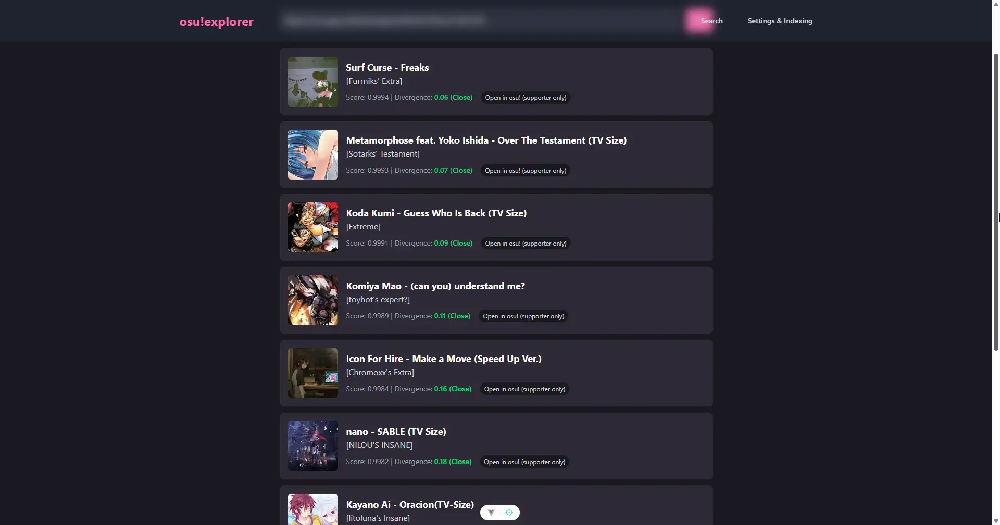
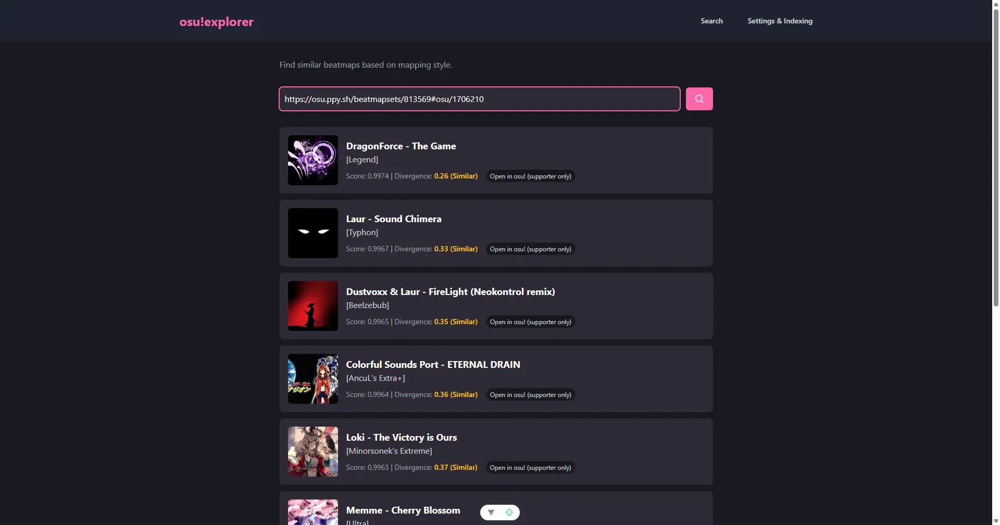
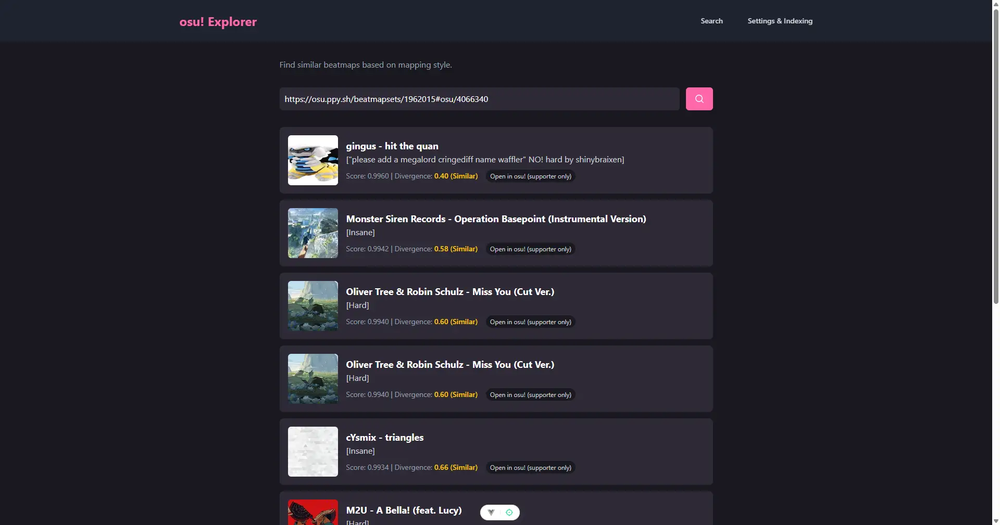
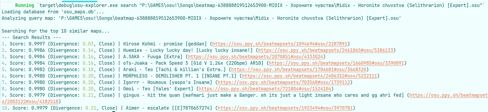

# osu!explorer 🦀

finding beatmaps using raw geometry and math. no ai black magic involved  
by [selithrarion](https://osu.ppy.sh/users/4613388)

pp jumps sotarks!!! ([more screenshots below](#more-screenshots)) (https://osu.ppy.sh/beatmapsets/842412#osu/1762728)  


---

**what is this?**  
a local engine that looks at your maps, extracts geometric features (angles, flow, rhythm density), and finds similar ones  

**how it works**  
1. parses `.osu` files
2. converts hitobjects into float vectors (fingerprint/embeddings)
3. shoves them into a custom vector db (my prev study project. IN RUST BTW)
4. uses ivf index (like elastic search) to quickly look for similar maps

**why manual features and not ai transformers?**  
too lazy to train a model. also geometry doesn't hallucinate xd

**does it actually work?**  
kindaaa~~  
it can definitely distinguish between a 1-2 jump farm and a tech map   
don't expect miracles!!! this is an **MVP built in a 2-day coding sprint** hahaha. it's fun to put my own map and see what the algo thinks is similar to it  
my osu dream is a pattern/style recommendation system (like pinterest for maps), so mappers could find inspiration easily  

---

## usage
1. download the release
2. run it
3. point it to your `osu!/Songs` folder if it doesn't automatically
4. hit **Start Indexing** and wait a min
5. paste a beatmap link/id

## what it sees?
- **tech map:** high overlap, red slider anchors
- **jump farm:** high circle ratio, triangle angles, low rhythm variance
- **streams:** high object density
- **old school:** wide jumps, high overlap

TODO: symmetry feature?  
TODO: consider ar for overlaps  
TODO: slider curvature and slider art feature?    
TODO: linux build (but does it make sense? maybe only after lazer support)  
TODO: add lazer support (parse sqlite db?)  
TODO: add desktop app icon

## more screenshots
streams (https://osu.ppy.sh/beatmapsets/813569#osu/1706210)


funny that it can't find similar maps to my first ranked in 2023 (didn't pass that stress test huh)  
(OH AND ACTUALLY ITS SPOTLIGHTED!!! im still super happy with that even after 2+ years, thanks Lefafel for suggesting it to other spotlight curators yay) (https://osu.ppy.sh/beatmapsets/1962015#osu/4066340)


intended to be used like that but ui is always better


## dev
if you wanna compile it yourself or add more features:  
you need `rust`, `nodejs` and `pnpm` (also c++ build tools and webview support for tauri)  

**stack:** vuejs + rust + tauri  
**credits:** used `osuparse` crate, thanks!  

```bash
pnpm dev  # run everything
pnpm build # or prod build
